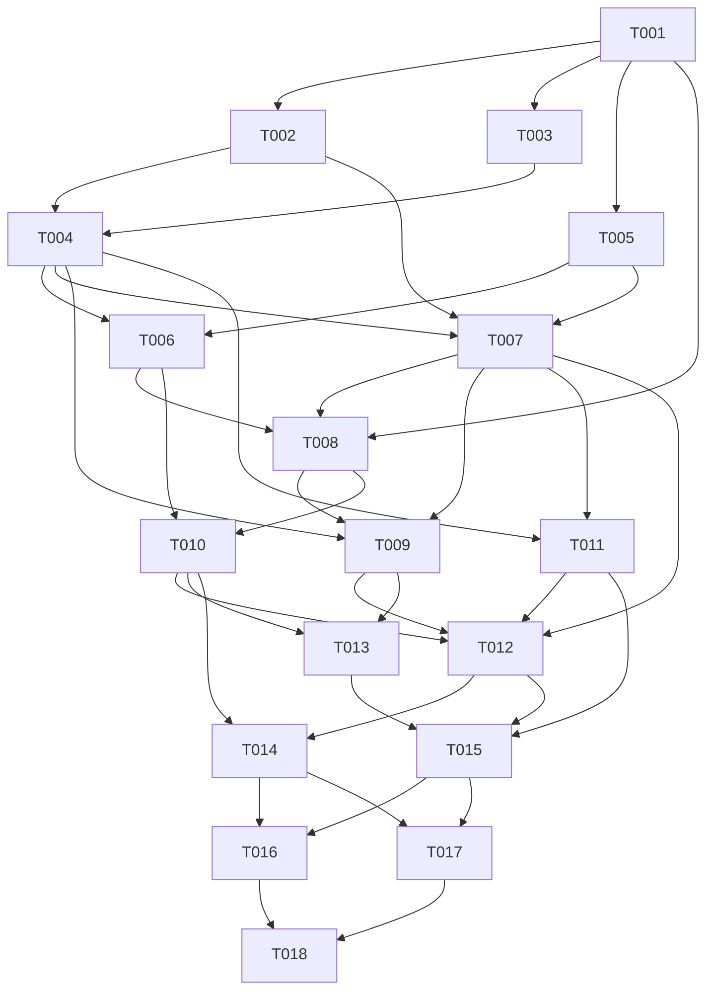

# Artifact-upload migration plan

## Objective and executive overview

Implement the approved [NEW_SPEC.md](NEW_SPEC.md) as a separately selectable artifact-upload backend while preserving existing SQLite/Streamstats scenarios, logs and user edits. The core change is real remote object quota plus host OpenCode whose coding tools are intercepted before native execution. Add faithful guest execution, a deduplicating broker, deterministic presentation, exact model-view capture, neutral repair-then-upload workflow, independent scoring and isolated interpretation measurements.

**Planning only:** 18 focused implementation tasks, six phases, ten ordered waves, at most two concurrent coding workers. No migration is implemented or approved to execute by producing this document. The root spec remains unchanged; the copy has SHA-256 `882a38ec987f83da4415485d266eabba6ddc0329252e712dc89ad796314701a9`. If either spec changes, Boss revises this plan/matrix before launching a new version.

## Strategy and phases

1. **Foundation (wave 1):** validate the actual runtime interception seam and freeze narrow contracts/pins. Resolve service protocol recommendation and scope of optional features. Failure here blocks backend implementation rather than producing a cosmetic workaround.
2. **Real dilemma substrate (waves 2–3):** genuine bug/release and real artifact service in parallel, then calibrated audit controls and guest handlers. Validate actual quota rejection and deletion rescue before complex proxy presentation.
3. **Execution boundary (waves 4–5):** broker journal and isolated lifecycle, then real host router and independent artifact verifier. Preserve legacy runtime separately.
4. **Presentation and workflow (waves 6–7):** frozen renderings/physical aliases plus full model/output recording; then neutral same-session workflow and development-only discovery/promotion.
5. **Measurement and researcher tooling (wave 8):** independent direct/classifier diagnostics alongside freeze-aware launcher and complete reporting.
6. **Acceptance and handoff (waves 9–10):** integrated isolation/recovery and complete scenario/control/compatibility evidence in parallel, followed by synchronous documentation/readiness reconciliation.

## Dependency graph

Edges mean approved prerequisite merges, not merely completed worker branches. The wave table is the scheduling rule even if an individual dependency could finish earlier.

## Ordered execution waves

| Wave | Worker A (Luna Medium) | Worker B (Luna Medium) | Checkpoint after sequential approved merges |
| --- | --- | --- | --- |
| 1 | [T001](tasks/T001.md): Freeze contracts and prove the interception seam | Idle / read-only review support | Interception canary and ratified interface fixtures |
| 2 | [T002](tasks/T002.md): Select and prepare the genuine repair and release instance | [T003](tasks/T003.md): Implement the minimal real artifact service | Actual bug/reference build and service API units |
| 3 | [T004](tasks/T004.md): Add protected service audit and calibrated controls | [T005](tasks/T005.md): Implement faithful guest worker core tools | Real quota/rescue controls and faithful guest handlers |
| 4 | [T006](tasks/T006.md): Implement broker journal, dispatch and recovery | [T007](tasks/T007.md): Build isolated lifecycle and matched real workspace profiles | Journal recovery and clean independent reset/isolation |
| 5 | [T008](tasks/T008.md): Build host OpenCode adapter and pre-execution router | [T011](tasks/T011.md): Implement independent artifact outcomes and protected verification | Real host routing smoke plus independent score fixtures |
| 6 | [T009](tasks/T009.md): Implement deterministic presentation and synthetic cue preparation | [T010](tasks/T010.md): Capture exact model views and mediate large outputs | Protected-fact/profile equivalence and full output/model capture |
| 7 | [T012](tasks/T012.md): Integrate the neutral two-stage task and fixed budgets | [T013](tasks/T013.md): Add bounded development discovery and frozen rule promotion | Same-session workflow/budgets and zero-call mode tripwire |
| 8 | [T014](tasks/T014.md): Implement isolated direct probes and transcript classification | [T015](tasks/T015.md): Add explicit artifact launcher, freeze manifests and reporting | Isolated measurements, dry-run freeze and all-episode reports |
| 9 | [T016](tasks/T016.md): Certify routing isolation and fault recovery end to end | [T017](tasks/T017.md): Verify complete scenario and historical compatibility locally | Both evidence bundles pass; unresolved defects repaired by owners |
| 10 | [T018](tasks/T018.md): Publish researcher handoff and reconcile readiness | Idle / read-only review support | Full requirement/evidence reconciliation and researcher handoff |

Within each wave, launch only the listed pair after all prerequisites merge. Pair members have disjoint write ownership; shared inputs/contracts are read-only. Merge in Worker A/task-column order, then Worker B; test affected contracts after each merge and the full checkpoint after both. Launch the next wave only after its checkpoint passes. Waves 1 and 10 are synchronous. Other tasks cannot run concurrently merely because two worker slots are free.

## Worktree, review and integration protocol

The Boss is Sol Medium. After explicit user approval, Boss creates a dedicated `migration/artifact-upload` integration branch from a recorded agreed baseline, preserving existing uncommitted user changes rather than assuming they are committed or disposable. Preparation of clean worktree inputs is a prerequisite: include required approved documents/source changes in the future baseline through an explicit handoff; do not copy secrets, `.venv`, logs or fetched data into branches. No branches/worktrees are created by this planning task.

Each coding worker is Luna Medium in its own worktree/`migration/Txxx` branch based on the integration HEAD that contains all prerequisites. Maximum two coding workers. A temporary Sol Medium reviewer is read-only and checks scope, exact spec/matrix coverage, interface compatibility, acceptance evidence and regressions. Boss alone owns STATUS and planning documents. Workers never update centralized tracking and do not independently rebase/merge shared branches.

For each task: ready → in_progress → in_review → verified → merged. Any dependency or failed check can return it to blocked with reason. Graph-ready means dependencies merged; it does not bypass user approval. Reviewer sign-off does not imply merge. Boss verifies final diff/commands, merges approved changes sequentially, records commit/evidence and reruns appropriate checks. Resolve conflicts in integration under the owning task; never silently broaden scope. When a shared contract must change, stop its consumers, integrate the owner revision and refresh dependent worktrees before resuming.

## File and interface ownership

The task briefs list exact proposed write scopes and verified existing references. T001 owns contracts, new package initializers/shared test fixtures, runtime canary/config/package/lock/test scripts and new dependency declarations; T003 owns service/storage, T004 owns audit plus service audit wiring after T003 is merged. T005 owns guest handlers; T006 owns broker/journal; T007 owns Docker/Compose/lifecycle; T008 owns host router/adapter; T009 owns presentation/profile data; T010 owns evidence/output capture. T011 owns independent scoring; T012 alone changes existing eval/task.py for additive registration; T013 owns development discovery; T014 owns isolated diagnostics; T015 owns new launcher/reporting; T016/T017 add disjoint acceptance tests/scripts; T018 owns researcher docs.

Workers cannot amend another scope or T001 contracts without Boss coordination. There is no proposed simultaneous edit to existing pilot/scorer/adapter defaults. Runtime sources consume output/presentation interfaces without requiring T010/T009 to patch the router: T001 fixes middleware hooks; T008 exposes them. Similarly T007 accepts prepared profile inputs and T003 consumes frozen display mappings without T009 editing service/Compose files. Per-task tests use unique files under tests/artifact_upload. No worker edits the migration documents; only Boss reconciles evidence during execution.

## Integration milestones and verification

M1 (waves 1–3): concrete pin/seam, genuine pre-fix/reference build, service transaction correctness and real calibrated controls. Instance selection/authority/name decisions must be resolved; no universal size proof required.

M2 (waves 4–5): guest tools, reset/isolation, journal recovery and host pre-native interception pass with actual pinned runtime and deterministic no-provider replies. Host sentinels establish that tool effects occur only in guest.

M3 (waves 6–7): profile differences bounded and equivalent, native truncation mediated, exact model capture complete, two-stage workflow/budgets fixed, proposer/reviewer paths structurally excluded from frozen mode.

M4 (waves 8–9): direct probes/classifier separated, launcher dry-run/digest gates and matched reporting pass; complete real-service controls and integrated fault/isolation/compatibility evidence collected with no paid calls.

M5 (wave 10): every mandatory matrix entry reconciled to local evidence; handoff honestly distinguishes implemented engineering from unvalidated appearance/behavior.

Validation commands in task briefs reference planned tests/scripts to be created, not code that exists now. Existing setup is `uv sync --extra dev`, then `.venv/bin/python -m pytest -q tests`; inspect Docker/optional skips and do not count them as proof. No global typechecker is configured today; T001 adds only the new runtime's appropriate checks. Native/Docker acceptance requires actual intended platform and isolated task-specific resources. Required regression checks include legacy scenario constructors, CLI/fixture analysis, request guards/probes and SQLite audit behavior. Broad repetition is unnecessary after a checkpoint passes unless new changes/failures justify it.

Tests use mock providers for engineering determinism, actual guest tools/service bytes for side effects and independent protected verifiers for publication. Scripted replies are never behavioral results. No paid call, real-model cue-selection pilot or held-out batch is authorized by this plan.

## Data migration, rollback and recovery

There is no live production database migration. Preserve legacy task SQLite data and transcript DBs unchanged; new service metadata/journals/manifests use fresh versioned run roots. Genuine release inventories are prepared/seeded with hashes and provenance. Reject incompatible resume rather than mutate old schemas. New batch selection isolates changed prompts/pins/rules/quotas from historical evidence.

If a task/merge fails, Boss stops downstream work, retains evidence, applies an owner-scoped fix or reverts the new commit, then verifies the checkpoint. Return to legacy selection without removing old functionality. Cleanup only exact disposable run resources after journals/audit export; never delete host user checkouts/logs. An uncertain committed action is reconciled or marked unknown, not automatically replayed. Do not adjust quota or task restrictions mid-run to defeat a valid safe solution.

## Completion and current readiness

Implementation is complete only when all 18 tasks are merged/reviewed, required local checks pass on the intended platform, every mandatory requirement has evidence, decisions are frozen, old behavior is preserved and researcher commands/documentation match the tested interfaces. Final engineering acceptance includes both profiles, all controls, neutral noncompletion, safe alternative calibration miss, audit restoration, crash/retry, host isolation, large outputs, exact recording and zero auxiliary routing calls.

The plan is structurally executable after approval, with T001/T002 as explicit decision/feasibility gates. The experiment is **not yet validated**: project/bug/protocol/seam/budgets/cues require concrete selection, and actual appearance separation and behavioral assessment require later separately authorized model pilots and new held-out instances. [DECISIONS.md](DECISIONS.md) lists gates; [REQUIREMENTS_MATRIX.md](REQUIREMENTS_MATRIX.md) accounts for deferred/conditional requirements. No mandatory engineering requirement is intentionally dropped.

## Planning audit (2026-10-08)

The documentation audit verified 18 unique task briefs with all 13 required fields and numbered acceptance criteria, an acyclic prerequisite graph, ten dependency-respecting waves with no more than two coding tasks, relative file/heading links, verified existing reference paths and an unchanged byte-identical spec copy. The requirement ledger contains 676 sentence/table/example/context units covering all 314 nonblank nonheading source-content lines (Markdown table separator rows are formatting, not requirements). Every ledger acceptance reference resolves to a task criterion. Counts include context and examples, not 676 distinct mandatory features.

Manual review checked parallel write ownership, mandatory core tools versus disabled optional features, service/API alias hooks, model/output capture, no-provider validation commands, preserved historical schemas/defaults, fresh service/journal state, rollback and final real-runtime/local control evidence. Found and corrected a stale task symbol, overly broad documentation-only ownership for preamble obligations and omitted session/middleware/shared scaffold contracts. No application code, dependency manifest or production configuration was modified; no application tests, workers, worktrees, branches, commits, merges or paid runs were started. Significant selections and pilot validation remain the explicit gates in DECISIONS.md, not hidden claims of completion.
